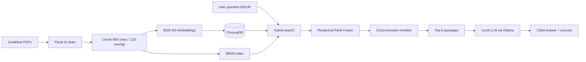

# MedRAG: Bilingual Medical Guidelines Assistant

A **local, privacy-friendly Retrieval-Augmented Generation (RAG)** system that answers questions about public health guidelines in **English and Urdu**, with **source citations** and **refusal when the answer isn't in the documents**.

> ⚠️ **Status: work in progress.** The core pipeline is implemented; evaluation results are not yet published (see [Results](#results) and [Roadmap](#roadmap)).

> ⚕️ **Disclaimer:** This is a portfolio/educational project. It is **not** a medical device and does **not** provide medical advice. Always consult a qualified clinician.

---

## Why this project

General chatbots can answer medical questions confidently and wrongly. This project explores how to make answers **grounded and checkable**:

- Answers come **only** from retrieved guideline passages
- Every claim is **cited** (document + page)
- The assistant says *"I could not find this in the provided guidelines"* instead of guessing
- Runs **fully locally**, so no data leaves your machine
- Retrieval quality is **measured**, not assumed

## Architecture



| Component | Choice | Why |
|---|---|---|
| Embeddings | `BAAI/bge-m3` | Multilingual, handles English and Urdu |
| Vector store | ChromaDB (cosine) | Simple, local, persistent |
| Keyword search | BM25 (`rank-bm25`) | Catches exact drug names, doses, acronyms |
| Fusion | Reciprocal Rank Fusion | Combines both rankings without score tuning |
| Reranker | `BAAI/bge-reranker-v2-m3` | Improves precision of the final top-k |
| LLM | `qwen2.5:7b-instruct` via Ollama | Free, local, multilingual |
| API | FastAPI | Typed, documented endpoint |

## Project structure

```
medrag/
├── src/
│   ├── config.py      # models, paths, chunking and retrieval settings
│   ├── ingest.py      # PDF → chunks → embeddings → ChromaDB + chunks.jsonl
│   ├── rag.py         # hybrid retrieval, reranking, grounded generation
│   ├── api.py         # FastAPI app (POST /ask, GET /health)
│   └── evaluate.py    # retrieval evaluation (hit@k, MRR) per search mode
├── eval/
│   └── questions.jsonl  # evaluation questions with ground-truth source/page
├── data/
│   └── raw/           # put guideline PDFs here (not committed)
├── requirements.txt
└── README.md
```

## Quickstart

**Requirements:** Python **3.11 or 3.12** (newest Python versions may lack PyTorch/ChromaDB builds), [Ollama](https://ollama.com), and roughly 16 GB RAM for the 7B model (use the 3B model otherwise).

### 1. Install

**Windows (PowerShell)**
```powershell
git clone https://github.com/<your-username>/medrag.git
cd medrag
py -3.12 -m venv .venv
.venv\Scripts\Activate.ps1
pip install -r requirements.txt
```
If PowerShell blocks activation, run once: `Set-ExecutionPolicy -Scope CurrentUser RemoteSigned`

**macOS / Linux**
```bash
git clone https://github.com/<your-username>/medrag.git
cd medrag
python3.12 -m venv .venv
source .venv/bin/activate
pip install -r requirements.txt
```

### 2. Get a local model
```bash
ollama pull qwen2.5:7b-instruct
# low on RAM? use: ollama pull qwen2.5:3b-instruct  (and edit LLM_MODEL in src/config.py)
```

### 3. Add documents
Download guideline PDFs into `data/raw/`. See [Source documents](#source-documents) below for suggested public sources.

### 4. Build the index
```bash
python src/ingest.py
```

### 5. Run the API
```bash
cd src
uvicorn api:app --reload
```
Open **http://localhost:8000/docs** for the interactive API page, or call it directly:

```bash
curl -X POST http://localhost:8000/ask \
  -H "Content-Type: application/json" \
  -d '{"question": "What is the recommended duration of the standard drug-susceptible TB regimen?"}'
```

**Response shape**
```json
{
  "answer": "... [1] ...",
  "sources": [{"n": 1, "source": "file.pdf", "page": 12, "snippet": "..."}],
  "latency_s": 0.0
}
```

## Source documents

PDFs are **not committed** to this repository because redistribution terms vary by publisher. Download them into `data/raw/` and run `python src/ingest.py`. Use short filenames; the filename appears in answer citations.

| Suggested filename | Document | Page |
|---|---|---|
| `who_tb_care_support_2022.pdf` | WHO consolidated guidelines on TB, Module 4: TB care and support (45 pp, good for a first test) | https://www.who.int/publications/i/item/9789240047716 |
| `who_tb_ds_2022.pdf` | WHO consolidated guidelines on TB, Module 4: drug-susceptible TB treatment (72 pp) | https://www.who.int/publications/i/item/9789240048126 |
| `who_tb_treatment_care.pdf` | WHO consolidated guidelines on TB, Module 4: treatment and care (358 pp, large-document test) | https://www.who.int/publications/I/item/9789240107243 |
| `who_hepb_2015.pdf` | WHO guidelines for chronic hepatitis B infection (2015) | https://www.who.int/publications/i/item/9789241549059 |
| `who_hepbc_consolidated.pdf` | WHO consolidated guidance on hepatitis B and C | https://www.who.int/publications/i/item/9789240119529 |
| `who_antenatal_care_2016.pdf` | WHO recommendations on antenatal care for a positive pregnancy experience | https://www.who.int/publications/i/item/9789241549912 |
| `pak_tb_nsp_2024_2026.pdf` | Pakistan National Strategic Plan for TB Control 2024-2026 | https://extranet.who.int/cpcd/sites/default/files/public_file_repository/PAK_Pakistan_National-Strategic-Plan-TB-Control_2024-2026.pdf |

The WHO links open the publication page; use its **Download** button to get the PDF.

**Notes**

- Check each document's license before redistributing anything.
- Prefer text-based PDFs. Scanned image PDFs need OCR before ingestion.
- After adding or changing PDFs, re-run `python src/ingest.py` to rebuild the index.

## Evaluation

Retrieval is evaluated by checking whether the **correct (document, page)** appears in the top-k results.

1. Add questions to `eval/questions.jsonl`, one JSON object per line:
   ```json
   {"question": "…", "source": "who_tb_ds_2022.pdf", "page": 14}
   ```
2. Run from the repo root:
   ```bash
   python src/evaluate.py
   ```
   It compares **BM25 only**, **vector only**, and **hybrid** search using hit@5 and MRR.

## Results

> Results will be added after the evaluation set is complete. No figures are claimed until measured.

| Retrieval mode | hit@5 | MRR |
|---|---|---|
| BM25 only | TBD | TBD |
| Vector only | TBD | TBD |
| Hybrid + rerank | TBD | TBD |

## Roadmap

- [x] PDF ingestion, chunking, multilingual embeddings
- [x] Hybrid retrieval (BM25 + vector + RRF) with cross-encoder reranking
- [x] Local LLM generation with citations and a refusal instruction
- [x] FastAPI endpoint
- [ ] Evaluation set (50+ questions) and published results table
- [ ] Out-of-scope / refusal test set
- [ ] Faithfulness evaluation (is each answer supported by its cited passages?)
- [ ] Urdu question set
- [ ] Streamlit UI with source viewer and feedback buttons
- [ ] Docker, CI, and a hosted demo

## Limitations

- Answers are only as good as the documents provided; the system does not know anything outside them.
- PDF parsing quality varies. Complex tables may be extracted imperfectly.
- Small local models can still make mistakes. Citations exist so answers can be verified, not blindly trusted.
- Urdu performance has not yet been formally evaluated.

## License

Code: MIT (add a `LICENSE` file before publishing).
Guideline documents are **not** included in this repository and remain under their original licenses.
